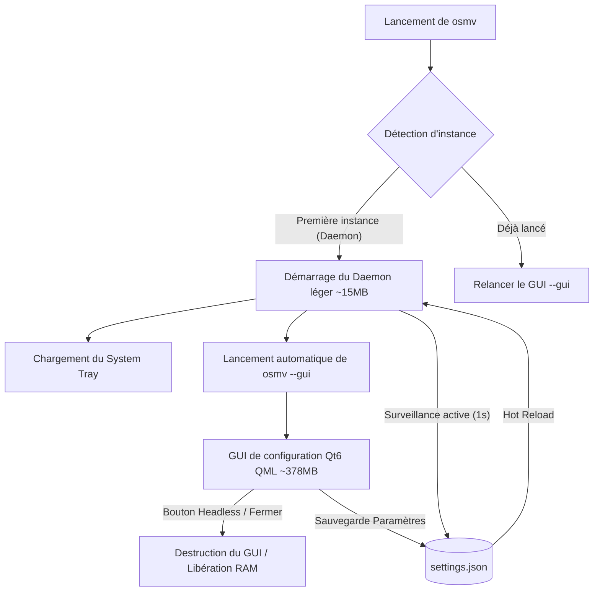

# Architecture Technique d'OSMV 📐

OSMV a été repensé pour allier la richesse visuelle de **Qt 6 QML** pour sa configuration et la performance brute de **Rust** pour son exécution en arrière-plan.

---

## 🔄 Le Modèle Bi-processus (Dual-Process)

Historiquement, faire tourner une interface Qt en continu pour un widget OBS consommait inutilement environ 380 Mo de RAM. OSMV résout ce problème en séparant l'application en deux entités s'exécutant au sein du même binaire.

### 1. Le Daemon (Processus Père)
- **Rôle** : C'est le service persistant. Il ne possède aucun élément visuel à part l'icône dans la barre des tâches.
- **Taille mémoire** : **~15 Mo de RAM**.
- **Tâches** :
  - Interroger les APIs système de lecture média (WinRT / MPRIS) toutes les secondes.
  - Formater et écrire les fichiers `current_song.json` et `current_time.txt`.
  - Mettre à jour l'état Discord RPC.
  - Gérer l'icône de notification (tray) et son menu contextuel.

### 2. Le GUI (Processus Enfant)
- **Rôle** : C'est l'interface de configuration lourde lancée avec l'argument `--gui`.
- **Taille mémoire** : **~378 Mo de RAM**.
- **Tâches** :
  - Afficher les menus interactifs en QML.
  - Permettre de modifier les paramètres en temps réel et les écrire dans `settings.json`.
  - Se fermer proprement sur demande pour libérer instantanément la mémoire.

---

## ⚡ Mécanisme d'IPC & Extinction

La communication et la synchronisation entre les processus se font de deux manières :

### 1. Hot Reloading via `settings.json`
Le daemon lit le fichier `settings.json` périodiquement. Dès que le GUI modifie et sauvegarde une configuration, le daemon recharge instantanément ses variables locales. Ainsi, pas besoin de redémarrer le service d'arrière-plan pour appliquer des modifications de widget ou de Discord RPC.

### 2. Signal de Fermeture totale via fichier de verrou (`quit.lock`)
- Lorsque vous fermez le GUI via le bouton **Passer en Headless** (icône lune) ou via le bouton rouge standard de la fenêtre, le processus GUI s'arrête simplement. Le daemon reste actif.
- Lorsque vous cliquez sur le bouton **Quitter complètement** (icône croix rouge) dans l'interface, le GUI crée temporairement un fichier de verrou appelé `osmv_quit.lock` dans le dossier temporaire du système.
- Le daemon, qui surveille ce verrou à chaque tick, détecte sa présence, le supprime, écrit un état `null` dans `current_song.json` (pour effacer le widget OBS) et s'arrête proprement.

---

## 🎨 Chargement de l'icône de notification

Le daemon intègre l'icône système de façon native et portable :
- **Rust crates** : `tray-icon` (sans `libxdo` sous Linux pour maximiser la compatibilité) et `image`.
- **Format** : Il charge directement le fichier `assets/OSMV_logo.ico` depuis la mémoire à l'aide de `include_bytes!`, le décode avec la crate `image` au format RGBA brut, puis le passe à l'API système du tray. Cela évite d'avoir à distribuer l'icône séparément du binaire.
